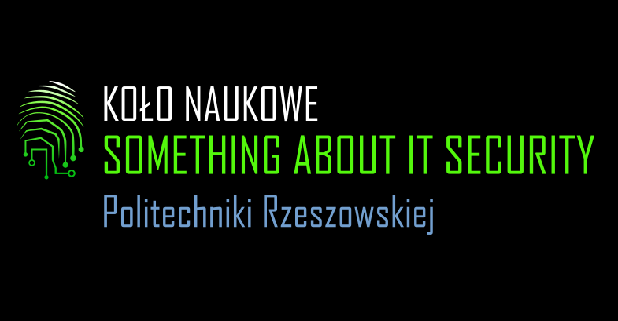

<a name="readme-top"></a>

<br />
<div align="center">
  <a href="https://github.com/benmotyka/saits_api">
    
  </a>
  <h1 align="center">Something About IT Security</h1>
  <h3 align="center">Science Club</h3>
  <h5 align="center">Back-end App</h5>
  <p align="center">
    <a href="https://github.com/benmotyka/saits_api/issues">Report Bug</a>
    ·
    <a href="https://github.com/benmotyka/saits_api/issues">Request Feature</a>
  </p>
</div>

<!-- TABLE OF CONTENTS -->
<details>
  <summary>Table of Contents</summary>
  <ol>
    <li>
      <a href="#about-the-project">About The Project</a>
      <ul>
        <li><a href="#built-with">Built With</a></li>
      </ul>
    </li>
    <li>
      <a href="#getting-started">Getting Started</a>
      <ul>
        <li><a href="#prerequisites">Prerequisites</a></li>
        <li><a href="#installation">Installation</a></li>
      </ul>
    </li>
    <li><a href="#contributing">Contributing</a></li>
    <li><a href="#contact">Contact</a></li>
  </ol>
</details>

<!-- ABOUT THE PROJECT -->

## About The Project

Server app for [https://saits.prz.edu.pl](https://saits.prz.edu.pl) and [https://keepitsecure.prz.edu.pl](https://keepitsecure.prz.edu.pl) websites. 

Please refer to [https://github.com/benmotyka/saits_front](https://github.com/benmotyka/saits_front) or [https://github.com/benmotyka/kis_front](https://github.com/benmotyka/kis_front) to get more information about the projects.

### Built With

* [Node.js](https://nodejs.org/)
* [Express JS](https://expressjs.com/)

<!-- GETTING STARTED -->

## Getting Started

### Prerequisites

- [Node.js](https://nodejs.org/en/download/)
- [hCaptcha](https://www.hcaptcha.com/)
- SMTP details for email account of your choice

### Installation

1. Clone this repo
   ```sh
   git clone https://github.com/benmotyka/saits_api.git
   ```
2. Install NPM packages
   ```sh
   npm install
   ```
3. Create `.env` file and enter:
   ```
   PORT=<backend_app_port> // eg: 3001
   SMTP_HOST=<host> // eg: smtp.gmail.com
   SMTP_PORT=<port> // eg: 465
   SMTP_USER=<email>
   SMTP_PASSWORD=<password>
   SAITS_EMAIL=<email>
   HCAPTCHA_SECRET=<secret> 
   ```
4. Run app
   ```sh
   npm run dev
   ```
<p align="right">(<a href="#readme-top">back to top</a>)</p>

<!-- CONTRIBUTING -->

## Contributing

Contributions are what make the open source community such an amazing place to learn, inspire, and create. Any contributions you make are **greatly appreciated**.

If you have a suggestion that would make this better, please fork the repo and create a pull request. You can also simply open an issue with the tag "enhancement".
Thanks again!

1. Fork the Project
2. Create your Feature Branch (`git checkout -b feature/AmazingFeature`)
3. Commit your Changes (`git commit -m 'Add some AmazingFeature'`)
4. Push to the Branch (`git push origin feature/AmazingFeature`)
5. Open a Pull Request

<p align="right">(<a href="#readme-top">back to top</a>)</p>

<!-- LICENSE
## License

Distributed under the MIT License. See `LICENSE.txt` for more information.

<p align="right">(<a href="#readme-top">back to top</a>)</p>
 -->

## Contact

Ben Motyka - [LinkedIn](https://www.linkedin.com/in/ben-motyka-97a729240/) - benmotykax@gmail.com

Project Link: [https://github.com/benmotyka/saits_api](https://github.com/benmotyka/saits_api)

<p align="right">(<a href="#readme-top">back to top</a>)</p>

